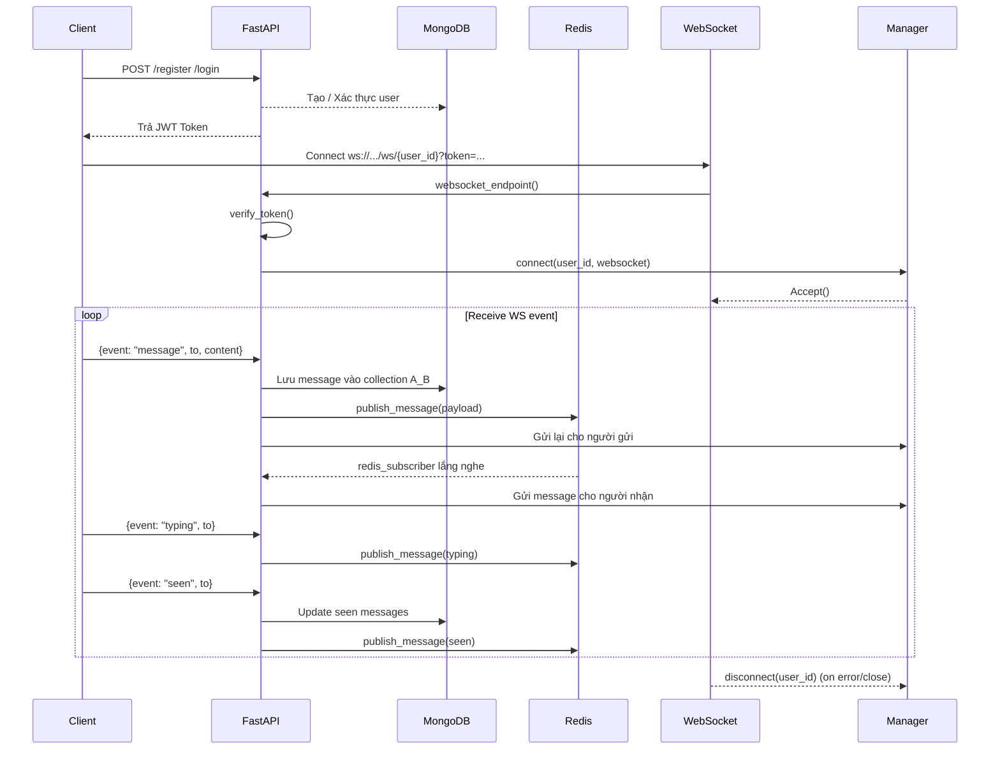

# Hướng Dẫn Cài Đặt và Chạy Backend FastAPI



1. **Cài đặt môi trường ảo env**:

```bash
pip install virtualenv 
```

2. **tạo môi trường ảo với name myenv**:

```bash
python -m venv venv
```

3. **start môi trường ảo myenv**:

```bash
venv\Scripts\activate
```

4. **Cài đặt các phụ thuộc**:

```bash
pip install -r requirements.txt
```

5. **Chạy ứng dụng**:

```bash
python run.py
```

6. **Biến môi trường**:

| Tên biến môi trường      | Giá trị               | Mô tả                               |
| ------------------------ | --------------------- | ----------------------------------- |
| SECRET_KEY        | your_super_secret_key | secret key |
| MONGO_URI    | mongodb://localhost:27017/ | Url mongodb                     |
| MONGO_DB | __________| mongodb name | 
|ALGORITHM | __________ | Thuật toán đối xứng jwt|
|REDIS_URL| redis://localhost:6379| redis |
